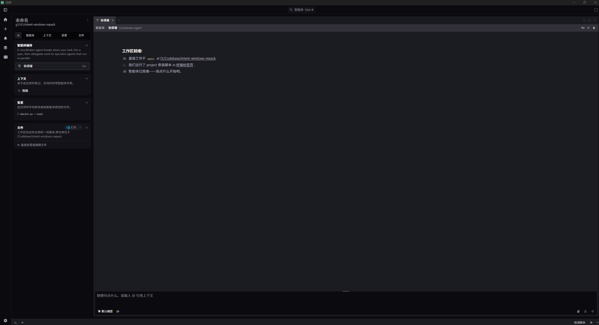

<div align="center">

# 🪟 Intent for Windows — 重打包工具

**把官方只发布 macOS `.dmg` 的 [Intent by Augment](https://www.augmentcode.com/) 重新打包成 Windows 可运行版本**

[](https://github.com/g1331/intent-windows-repack/actions/workflows/build.yml)
[](https://github.com/g1331/intent-windows-repack/releases/latest)
[](https://github.com/g1331/intent-windows-repack/releases)


*换掉「底座」，业务代码原样跑 —— 自带汉化、图标、原生模块修复、每日自动发版*

</div>

> ⚠️ **本仓库不包含 Intent 的任何代码或二进制。** 出于版权考虑，这里只放「怎么转换」的脚本与文档。你需要自备官方 macOS `.dmg`，脚本负责把它转换成 Windows 版。

---

## ✨ 亮点

| | |
| --- | --- |
| 🔄 **零改业务代码** | Electron 应用 99% 是跨平台 JS，只换运行时 + 原生模块即可 |
| 🈶 **运行时汉化** | 词典式 DOM 翻译，与版本解耦——升级不失配，没覆盖的文案保持英文 |
| 🎨 **Windows 观感修正** | 修掉 macOS 无边框设计在 Win 窗框里的黑边、隐藏原生菜单栏、换应用图标 |
| 🤖 **Agent 模型修复** | 补上新版 `claude-agent-acp` 与 Intent 的格式差异，让模型下拉框正常出模型 |
| ⚙️ **每日自动发版** | GitHub Actions 每天检查 stable / beta 两个频道，有新版自动重打包发布 |
| 📦 **双形态产物** | 免管理员安装器 + 绿色便携 zip，任选 |

## 🖼️ 界面预览

<!-- 截一张干净的实机图放到 docs/preview.png，然后取消下面这行注释即可显示：
<div align="center"></div>
-->

> 汉化后的 Intent 跑在 Windows 上的实机截图 —— *占位中，欢迎 PR 一张*。

---

## 🧩 一、为什么这事能成

Intent 是一个 **Electron 应用**。Electron 应用本质分三层，只有两层和操作系统绑定：

| 层 | 内容 | 跨平台吗？ | 处理方式 |
| --- | --- | :---: | --- |
| 应用代码 `app.asar` | 全部业务逻辑（JavaScript / 资源） | ✅ | 原样复用 |
| Electron 运行时 | `electron.exe` + 一堆 DLL | ❌ | 换成同版本的 Windows 版 |
| 原生模块 `*.node` | sharp、node-pty 等 C++ 扩展 | ❌ | 替换或重新编译 |

占应用 99% 体积的业务代码本就跨平台，真正要换的只是「底座」——把 macOS 的 Electron 运行时换成 Windows 的，再把几个原生模块换成 Windows 版。

> 🔑 **关键数字**：Intent 当前用 Electron `41.5.2`，对应 Node **ABI = 145**。所有原生模块必须同时满足 **win32-x64** 且 **ABI 145**，否则加载即崩。脚本会自动从 dmg 里探测这两个值，不写死。

---

## 🔧 二、四个原生模块各自怎么换

不同模块发布预编译包的方式不一样，策略也不同：

| 模块 | 策略 | 来源 |
| --- | --- | --- |
| `sharp` | 平台分包替换 | npm 包 `@img/sharp-win32-x64` |
| `@parcel/watcher` | 平台分包替换 | npm 包 `@parcel/watcher-win32-x64` |
| `better-sqlite3` | 预编译二进制替换 | GitHub Release 的 `electron-v145-win32-x64` prebuild |
| `node-pty` | **本机 / CI 现场编译** | node-gyp（关闭 Spectre + 三处源码补丁，见下方 §五） |

前三个有现成的 Windows 预编译包可下；只有 `node-pty` 没有匹配 Electron ABI 的预编译，必须用 C++ 工具链现场编译。

---

## 🚀 三、怎么用

### 方式 A：GitHub Actions（推荐，零本地依赖）

`windows-2022` runner 自带 VS 2022 C++ 工具链 / Node / Python / 7-Zip，正好满足全部编译需求（固定 2022 版，因 `windows-latest` 已升级到 node-gyp 暂不支持的 VS 2026）。支持两种运行方式：

- **定时自动发版**：工作流每天检查更新源的 **stable 与 beta 两个频道**，发现未发布过的新版本就自动重打包并发布，无需人工。stable 发正式 Release（tag `v<版本>`），beta 发 **prerelease**（tag `v<版本>-beta`，避免同版本号日后晋升 stable 时 tag 冲突）。
- **手动触发**：Actions 页 → **Build Intent for Windows** → **Run workflow**。
  - `dmg_url`：可选。直接给一个 `.dmg` 直链（只跑一路，产 artifact 不发 Release）；**留空则和定时一样检查两个频道**。
  - `force`：可选。即使该版本已发布过，也强制重打包。

> 🔐 **自动获取需要一个仓库 Secret：`INTENT_UPDATE_BASE_URL`**（Intent 的更新源基址）。在 **Settings → Secrets and variables → Actions** 中添加。出于尊重上游，本仓库不在代码或文档里写出该地址。

成品到 **Artifacts** 下载；自动获取场景同时发布到 **Releases**。每个版本产两种形态：

| 形态 | 说明 |
| --- | --- |
| 📥 **`Intent-Setup-<版本>.exe`** | 安装器（推荐）。免管理员，装到 `%LOCALAPPDATA%\Programs\Intent`，自动建开始菜单入口、「应用」里有卸载项；新版本双击覆盖升级。卸载只删应用本体，`%APPDATA%\intent` 里的登录/设置/会话数据保留。 |
| 🗜️ **`Intent-<版本>-win32-x64-*.zip`** | 绿色便携版。解压即用，运行 `IntentbyAugment.exe`。 |

### 方式 B：本地运行

需要本机具备：**VS Build Tools**（含 C++ 工具链，编译 node-pty 用）、**Node.js + Python**（node-gyp 依赖）、完整版 **7-Zip**（精简版不支持 APFS 格式的 dmg，脚本会自动定位）。

```powershell
# dmg 在本地
pwsh scripts/repack.ps1 -DmgPath "D:\下载\Intent.dmg"

# 或给一个下载直链
pwsh scripts/repack.ps1 -DmgUrl "https://.../Intent.dmg"

# 或自动获取最新稳定版（先设更新源基址）
$env:INTENT_UPDATE_BASE_URL = "<Intent 更新源基址>"
pwsh scripts/repack.ps1
```

成品输出到 `dist\Intent-<应用版本>-win32-x64-*.zip`，解压即用。

> dmg 来源优先级：`-DmgPath` > `-DmgUrl` > 自动获取（从 `<UpdateBaseUrl>/<Channel>/latest-mac.yml` 解析最新版）。

<details>
<summary><b>全部命令行参数</b></summary>

| 参数 | 说明 | 默认值 |
| --- | --- | --- |
| `-DmgPath` | 本地 dmg 路径 | — |
| `-DmgUrl` | dmg 下载直链 | — |
| `-Channel` | 自动获取的更新频道（stable / beta） | `stable` |
| `-UpdateBaseUrl` | 自动获取的更新源基址 | 环境变量 `INTENT_UPDATE_BASE_URL` |
| `-OutDir` | 成品输出目录 | `<repo>\dist` |
| `-WorkDir` | 临时工作目录（已被 `.gitignore` 排除） | `<repo>\.work` |
| `-ElectronMirror` | Electron 运行时下载镜像 | npmmirror 镜像 |

</details>

---

## 🛠️ 四、脚本做了哪几步

`scripts/repack.ps1` 全程从 dmg 动态探测版本，不写死任何版本号：

**底座替换（1–5）：把 macOS 运行时换成 Windows**

1. 解开 dmg，提取 `app.asar` / `app.asar.unpacked`，读出 Electron 版本与原生模块 ABI
2. 下载对应版本的 Windows 版 Electron 运行时
3. 把 `app.asar` **解成 `app` 目录**（绕开 asar 索引限制），并合并 `unpacked`
4. 用 Windows 预编译替换 `sharp` / `@parcel/watcher` / `better-sqlite3`
5. 现场编译 `node-pty`（关闭 Spectre 缓解 + 打补丁），装入

**Windows 适配（6–7）：汉化、观感与已知问题修复**

6. 注入汉化脚本 + 修正 Windows 下的窗口观感
7. 修复 Agent 模型下拉框为空

**成品封装（8–9）：图标与打包**

8. 从 dmg 的 `icon.icns` 提取应用图标，转成 `.ico` 后用 `rcedit` 写入 exe
9. 组装成 `Intent-win` 并打包为 zip

<details>
<summary><b>💡 为什么第 3 步要把 asar 解成目录？</b></summary>

`app.asar` 是带索引的归档文件。往 `app.asar.unpacked` 里新增文件（比如 Windows 版原生模块）是无效的——因为 asar 的索引里没有这个新条目，`require` 解析时根本找不到它。最干净的解法是把整个 `app.asar` 解成普通的 `app` 目录、删掉原 asar，这样 Electron 直接按目录加载，新增/替换文件就都能被认到。

</details>

<details>
<summary><b>🈶 第 6 步做了哪些定制？</b></summary>

三处，全在 `scripts/l10n/intent-zh.js` 一个脚本里注入：

- **汉化** —— 词典式 DOM 翻译。上游无 i18n 框架，静态改字符串每版都会失配；运行时按「英文原文→中文」词典替换则与版本解耦——词典没覆盖的文案保持英文，不会破坏应用。补充翻译直接往该文件的 `DICT` 加词条。
- **窗口观感** —— 上游按 macOS 无边框窗口设计，主内容卡片带外边距圆角、窗口底色近纯黑、顶栏带半透明黑遮罩，套进 Windows 原生窗框会露出一圈黑边；注入的 CSS 把卡片贴满窗口并统一底色。
- **菜单栏** —— 给主进程窗口参数打 `autoHideMenuBar` 补丁，隐藏原生菜单栏（按 Alt 可临时唤出）。

</details>

<details>
<summary><b>🤖 第 7 步在修什么？（模型下拉框为空）</b></summary>

Intent 的 Agent（Claude Code provider）通过 `claude-agent-acp` 适配器列出可选模型。新版适配器把模型放进 `session/new` 结果的 `configOptions`（model 类目的 select），而 Intent 内置的解析器只认旧格式 `models.availableModels`，于是取不到模型、下拉框一直空或卡在 Loading。补丁让解析器在旧字段缺失时回退解析 `configOptions`，并放宽结果处理分支的判定，兼容新旧两种格式。

另需**全局安装适配器**才能真正列出模型：`npm i -g @agentclientprotocol/claude-agent-acp`。否则 Intent 回退到 `npx -y @agentclientprotocol/claude-agent-acp`，冷启动超过取模型的 12 秒超时，同样列不出。适配器只是启动本机 `claude` CLI（需先 `npm i -g @anthropic-ai/claude-code`），不改变鉴权路径。

</details>

<details>
<summary><b>🎨 第 8 步的图标怎么来的？</b></summary>

dmg 里的 `Contents/Resources/icon.icns` 是 macOS 图标格式，Windows 不认。`scripts/icns2ico.js` 直接在 `.icns` 字节流里扫描内嵌的 PNG（现代 icns 内部就是多张不同分辨率的 PNG），取最大的一张，用 `png2icons` 生成多尺寸 `.ico`，再用 `rcedit` 写进 exe 的资源段。注意顺序：先给 `electron.exe` 写图标，再复制成应用名 exe，让副本天然继承图标。这两个依赖（`png2icons` / `rcedit`）脚本会自动 `npm install` / 下载，CI 的 windows runner 上同样适用。

</details>

---

## 🩹 五、node-pty 的三处源码补丁（已知问题修复）

`node-pty` 编译前，脚本会自动给它的 Windows 源码打三处补丁（若上游某天改了这些代码，脚本会打印 `patch 未命中` 警告，而不是静默漏修）：

| # | 文件 | 问题 | 修复 |
| :---: | --- | --- | --- |
| 1 | `conpty.cc` | **退出竞态**：关闭应用时主线程的 napi 环境正在拆除，ConPTY 后台线程的 `BlockingCall` 返回 `napi_closing`（非 `napi_ok`），旧代码 `assert(status == napi_ok)` 触发一个 C++ 运行时断言弹框 | 改为 `if (status != napi_ok) { delete exit_event; }`——容忍关闭阶段的正常失败，并手动清理（因为回调没执行，负责 delete 的代码不会跑） |
| 2 | `conpty.cc` | `assert(remove_pty_baton(id))` 把**有副作用的调用**放进了断言里 | 把调用拎出来：`remove_pty_baton(id);` |
| 3 | `winpty.cc` | 同上：`assert(remove_pipe_handle(pid))` | `remove_pipe_handle(pid);` |

<details>
<summary><b>第 2、3 处为什么是隐患？</b></summary>

C/C++ 里一旦定义了 `NDEBUG`（Release 构建的惯例），`assert(...)` 会被预处理器**整体删除**，连里面的函数调用一起没了。把清理资源的 `remove_*` 调用写在 assert 里，等于在 Release 下静默泄漏。这是公认的反模式，顺手一并修掉。

</details>

---

## 🔬 六、诊断脚本

`scripts/probe.js` 用来验证「某个 `app` 目录里的原生模块，能不能在目标 Electron ABI 下被加载」。

原理：设置 `ELECTRON_RUN_AS_NODE=1` 让 `electron.exe` 退化成一个**带 Electron ABI 的 Node 解释器**，然后逐个 `process.dlopen` 各模块——能 `OK` 就说明这个 `.node` 与当前 ABI 匹配。

```powershell
$env:ELECTRON_RUN_AS_NODE = 1
& "<解压目录>\Intent.exe" scripts\probe.js "<解压目录>\resources\app\node_modules" out.txt
type out.txt
```

输出形如：

```
runtime: electron=41.5.2 node=... modules(ABI)=145 platform=win32 arch=x64
---
OK    better-sqlite3 (replaced->win)
OK    sharp           (added->win)
OK    parcel-watcher  (added->win)
OK    node-pty        (...)
```

---

## ⚖️ 七、法律说明

本仓库仅包含重打包**脚本与文档**，不分发 Intent 的任何代码或资源。Intent 版权归 Augment 所有。请在已合法获取 Intent 的前提下，将重打包产物用于个人在 Windows 上的自用目的。
